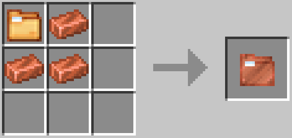
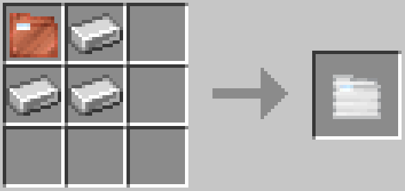
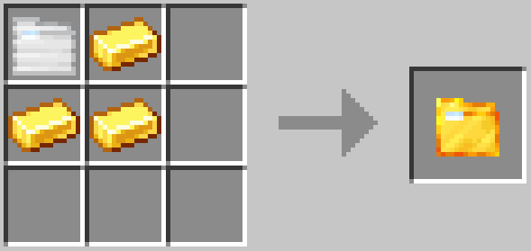
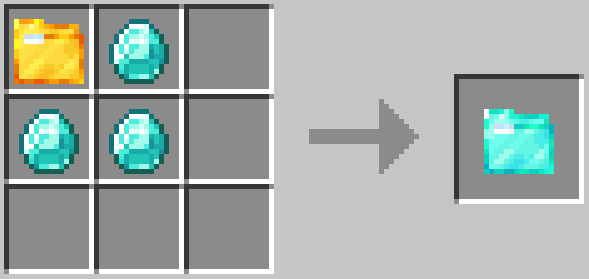
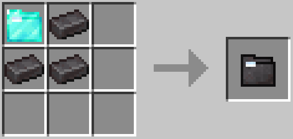

---
navigation:
  title: Filing Folders
  icon: realfilingreborn:netherite_filing_folder
  parent: index.md
  position: 2
item_ids:
  - realfilingreborn:filing_folder
  - realfilingreborn:copper_filing_folder
  - realfilingreborn:iron_filing_folder
  - realfilingreborn:gold_filing_folder
  - realfilingreborn:diamond_filing_folder
  - realfilingreborn:netherite_filing_folder
---

# Filing Folders

Filing Folders store a **single item type** each. They come in six tiers with increasing capacity.

<ItemGrid>
  <ItemIcon id="filing_folder" />
  <ItemIcon id="copper_filing_folder" />
  <ItemIcon id="iron_filing_folder" />
  <ItemIcon id="gold_filing_folder" />
  <ItemIcon id="diamond_filing_folder" />
  <ItemIcon id="netherite_filing_folder" />
</ItemGrid>

<Row>
<RecipeFor id="filing_folder" />
<RecipeFor id="copper_filing_folder" />
<RecipeFor id="iron_filing_folder" />
</Row>

<Row>
<RecipeFor id="gold_filing_folder" />
<RecipeFor id="diamond_filing_folder" />
<RecipeFor id="netherite_filing_folder" />
</Row>

| Tier | Capacity |
|------|----------|
| Base | 4,096 |
| Copper | 32,768 |
| Iron | 262,144 |
| Gold | 2,097,152 |
| Diamond | 16,777,216 |
| Netherite | 134,217,728 |

Filing Folders **cannot** store items with NBT data such as enchantments, custom names, or damage values.

## Using a Filing Folder

**Shift + Right-click** a Filing Folder to open its GUI, where you can assign an item type, deposit items, and extract them.

## Resetting a Filing Folder

To reset an assigned but **empty** Filing Folder back to an unassigned state, place it **alone** in a crafting grid.

## Upgrading a Filing Folder

To upgrade a Filing Folder to the next tier, place it in a crafting grid along with **three of the next tier's material**. The folder's stored contents are preserved through the upgrade.

Base to Copper

Copper to Iron

Iron to Gold

Gold to Diamond

Diamond to Netherite

